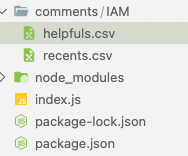
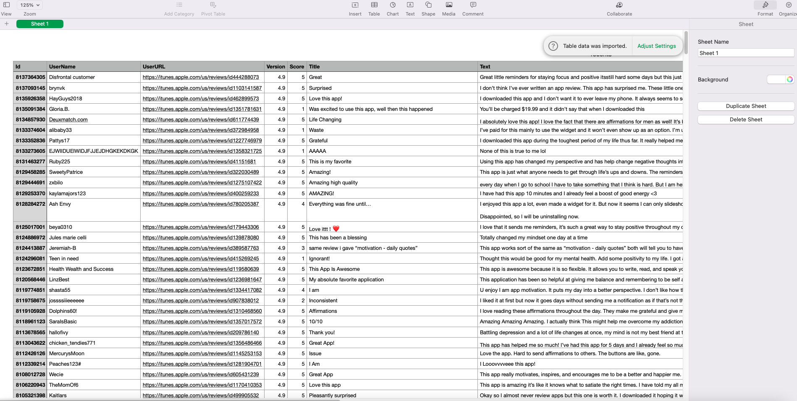

### Install

```bash
npm install appstore-comments-to-csv
```

### Description

- 500 comments will be collected from app store and generate `csv` files.
- Two types of collection files.
  - Helpful
  - Recent

### Usage

```jsx
const collectAppStoreComments = require("appstore-comments-to-csv");

// first argument => App Id
// second argument => App Name (name of directory which will contain result files)
collectAppStoreComments(874656917, "IAM");
```

```jsx
// get json object
const recentComments = await generateCommentsJSON(appId, store.sort.RECENT);
const helpfulComments = await generateCommentsJSON(appId, store.sort.HELPFUL);
```

### How to find AppStore App Id?


### Output




