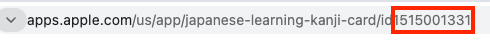

### Install

```bash
npm install appstore-comments-to-csv
```

### Description

- 500 comments will be collected from app store and generate `csv` files.
- Two types of collection files.
  - Helpful
  - Recent

### Usage

```jsx
const collectAppStoreComments = require("appstore-comments-to-csv");

// first argument => App Name
// second argument => App Id which can be found
collectAppStoreComments("IAM", 874656917);
```

### How to find AppStore App Id?



